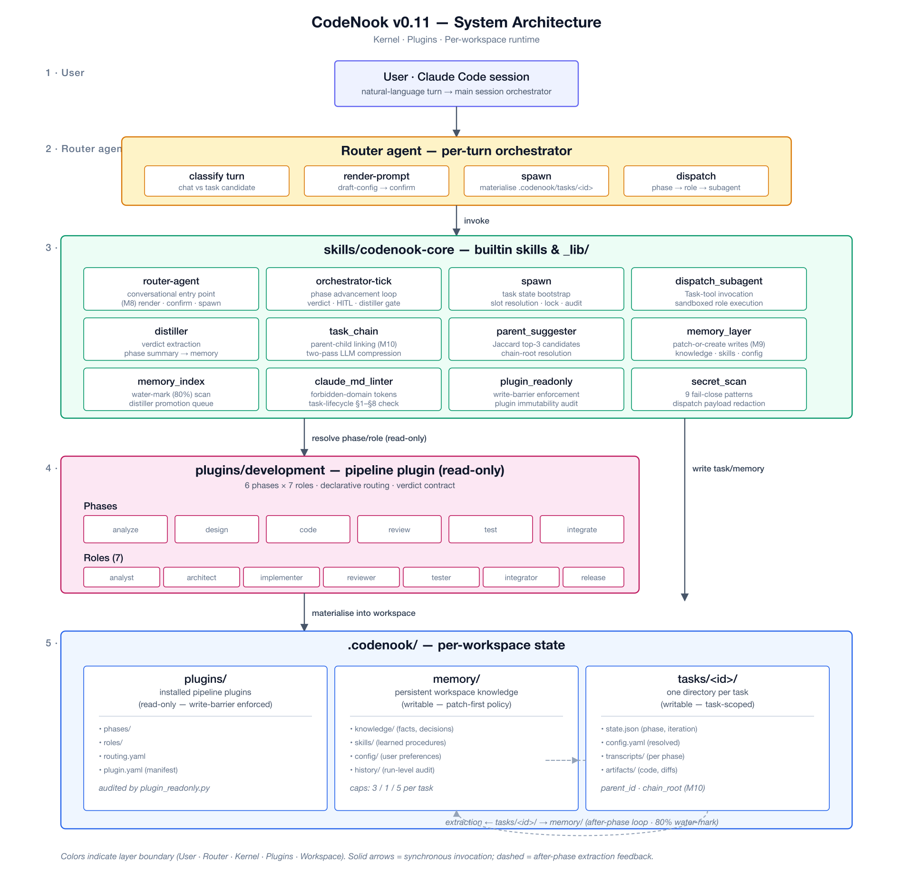

<p align="center">
  
</p>

<h1 align="center">🤖 Multi-Agent Software Development Framework</h1>

<p align="center">
  <a href="https://github.com/cintia09/multi-agent-framework/releases"></a>
  <a href="LICENSE"></a>
  <a href="https://github.com/cintia09/multi-agent-framework/stargazers"></a>
</p>

<p align="center">
  
  
  
  
  
  
</p>

<p align="center">
  <strong>Software development framework with 5 AI Agent roles — zero dependencies, FSM-driven, HITL approval gate, DFMEA risk management</strong>
</p>

<p align="center">
  <a href="#installation">Installation</a> ·
  <a href="#usage">Usage</a> ·
  <a href="#hitl-approval-gate">HITL Gate</a> ·
  <a href="#20-skills">20 Skills</a> ·
  <a href="#why-this-framework">Why</a> ·
  <a href="blog/vibe-coding-and-multi-agent.md">Blog</a>
</p>

---

Zero-dependency, file-based multi-agent collaboration framework for Claude Code and GitHub Copilot.

## Overview

Five specialized AI Agent roles collaborate through a file-based state machine covering the full Software Development Life Cycle (SDLC). Unified 11-state FSM + Human-in-the-Loop approval gate + DFMEA risk management.

| Role | Emoji | Responsibilities |
|------|-------|------------------|
| **Acceptor** | 🎯 | Requirements gathering (user-story format), task publishing, acceptance testing |
| **Designer** | 🏗️ | Architecture design (ADR format), technical research, test specs, goal-coverage self-check |
| **Implementer** | 💻 | TDD development (red-green-refactor + 80 % coverage), DFMEA risk analysis, build fixes |
| **Reviewer** | 🔍 | Design + code review, OWASP security checklist, severity rating, confidence filtering |
| **Tester** | 🧪 | Coverage analysis, flaky-test detection, E2E Playwright, issue reporting |

## Core Features

- **Zero Dependencies** — Pure Markdown Skills + JSON state files
- **File Persistence** — All state stored in Git-trackable files
- **Unified FSM** — 11-state linear pipeline; illegal transitions are rejected
- **HITL Approval Gate** — All 5 Agent phases require human approval before advancing
- **DFMEA Risk Management** — Implementer must output failure-mode analysis (S×O×D → RPN score)
- **Role Isolation** — Each Agent can only operate within its own scope
- **Hook Enforcement** — Agent boundaries enforced by Shell Hooks, not LLM self-discipline
- **Role Mismatch Detection** — Prompts a switch when user requests don't match the current role
- **Message Inbox** — Agents communicate via `inbox.json`
- **Feature Goal Checklist** — Each task has independently verifiable feature goals
- **Auto-Dispatch** — Task status changes automatically notify the next Agent
- **Batch Mode** — Agent processes all pending tasks in a single loop
- **Monitor Mode** — Fully automated Tester ↔ Implementer fix-verify loop
- **Issue Tracking** — Structured JSON + optimistic locking for concurrency safety
- **SQLite Audit Log** — Every tool invocation is logged to events.db
- **Task Memory** — Context snapshots saved automatically on phase completion; next Agent loads role-filtered memory
- **Staleness Detection** — Warns about tasks idle for too long
- **Pipeline Visualization** — ASCII diagram showing each task's position in the 5-phase pipeline
- **Project-Level Living Docs** — 6 docs/ files continuously updated by each Agent, reflecting the full project state
- **TDD Discipline** — Implementer strictly follows red-green-refactor + Git checkpoint + 80 % coverage gate
- **Security Review** — OWASP Top 10 checklist + 4 severity levels + confidence filtering
- **Coverage Analysis** — Auto-detects test framework, parses coverage, identifies blind spots
- **ADR Format** — Designer uses Architecture Decision Records for traceable decisions
- **Per-Agent Model** — Each role can use a different AI model (e.g., Opus for design, Sonnet for implementation)
- **Project-Type Awareness** — Auto-detects project type on init (iOS / frontend / backend / systems / AI-ML) and generates tailored Skills

## Task Lifecycle

```
created → designing → implementing → reviewing → testing → accepting → accepted ✅
                         ▲                          ▲  │          │
                         └── reviewing (rejected) ──┘  └── fixing ┘
                                                              ↕
                                                     (Tester ↔ Implementer
                                                      automated fix-verify loop)

accepting → accept_fail → designing (acceptance failed, back to design)
```

Any task can transition to `blocked` (requires human intervention) and be unblocked with `unblock`.

## Document Pipeline

Each phase produces standardized documents that serve as inputs for the next phase. Documents are stored in `.agents/docs/T-XXX/`:

```
Acceptor ──→ requirements.md + acceptance-criteria.md
               ↓
Designer ──→ design.md
               ↓
Implementer → implementation.md
               ↓
Reviewer ──→ review-report.md
               ↓
Tester ────→ test-report.md
               ↓
Acceptor ──→ Acceptance based on acceptance-criteria.md
```

- **⚠️ Document Gate**: FSM transitions automatically verify required output documents exist
- **📄 Auto-Prompt**: Switching Agents lists available input documents for the current task
- **📋 Standard Templates**: `agent-docs` skill provides 6 document templates

## HITL Approval Gate

All 5 Agent phase outputs must pass human approval (Human-in-the-Loop) before advancing to the next phase:

```
Agent creates document → Publishes to review page → Human reviews & comments → Agent revises → Human clicks "Approve" → FSM state transition
```

### 4 Platform Adapters

| Adapter | Environment | Features |
|---------|-------------|----------|
| 🌐 `local-html` | Local dev | HTTP server + dark-theme Web UI + multi-round feedback |
| 💻 `terminal` | Docker / SSH / CI | Pure CLI, zero browser dependency |
| 🐙 `github-issue` | GitHub projects | Collects feedback via Issue comments |
| 📝 `confluence` | Enterprise intranet | Confluence REST API publishing + comment polling |

- **Docker Auto-Detection**: Binds `0.0.0.0` and skips browser open when a container environment is detected
- **Multi-Round Feedback**: Submit feedback → Agent revises document → Re-publish → Review again, looping until Approve
- **Atomic Writes**: Uses `os.rename` for concurrency-safe reads and writes

### DFMEA Risk Management

The Implementer must output a DFMEA (Design Failure Mode and Effects Analysis) before coding:

| Field | Description |
|-------|-------------|
| Failure Mode | What could go wrong |
| Severity (S) | Severity rating 1–10 |
| Occurrence (O) | Probability rating 1–10 |
| Detection (D) | Detection difficulty 1–10 |
| **RPN** | **S × O × D** — Risk Priority Number |
| Mitigation | Specific measures required when RPN ≥ 100 |

The FSM Guard validates on state transition: items with RPN ≥ 100 must have mitigation measures, otherwise the transition is blocked.

## Installation

### Option 1: One-Line Install (Automated Script)

```bash
curl -sL https://raw.githubusercontent.com/cintia09/multi-agent-framework/main/install.sh | bash
```

Auto-detects Claude Code / Copilot CLI, downloads and installs all components.

### Option 2: Prompt-Based Install (AI-Guided)

Tell your AI assistant (Claude Code, GitHub Copilot, etc.):

> "Follow the instructions in the cintia09/multi-agent-framework repo to install agents locally."

The assistant will read the repo docs and automatically:

1. Clone the repo to a temporary directory
2. Copy 20 Skill directories to the target platform's skills directory
3. Copy 5 `.agent.md` files to the agents directory
4. Copy 13 Hook scripts + `hooks/lib/` modules + hooks.json to the hooks directory
5. Install 3 modular rules to the rules directory
6. Append collaboration rules to the global instructions file (idempotent)
7. Clean up the temporary directory

**Target Directories:**

| Platform | Skills | Agents | Hooks | Rules | Global Instructions |
|----------|--------|--------|-------|-------|---------------------|
| Claude Code | `~/.claude/skills/` | `~/.claude/agents/` | `~/.claude/hooks/` | `~/.claude/rules/` | `~/.claude/CLAUDE.md` |
| Copilot CLI | `~/.copilot/skills/` | `~/.copilot/agents/` | `~/.copilot/hooks/` | — | `~/.copilot/copilot-instructions.md` |

**hooks.json Format Differences**: Claude Code uses `hooks.json` (PascalCase, `command`, milliseconds); Copilot CLI uses `hooks-copilot.json` (camelCase, `bash`, seconds). The install script selects the correct format automatically.

**Permissions**: All `.sh` files need `chmod +x`.

### Verify Installation

```bash
bash install.sh --check
```

After installation, the `~/.claude/` directory structure:
```
~/.claude/
├── CLAUDE.md       # Contains Agent collaboration rules
├── rules/                               # Modular rules (path-scoped)
│   ├── agent-workflow.md                # Role + FSM rules (path-scoped)
│   ├── security.md                      # Security rules (path-scoped)
│   └── commit-standards.md              # Commit conventions
├── hooks/
│   ├── hooks.json                # Hook config (9 event types)
│   ├── agent-session-start.sh    # Initialize events.db, check pending items
│   ├── agent-pre-tool-use.sh     # Agent boundary enforcement
│   ├── agent-post-tool-use.sh    # Audit log + auto-dispatch
│   ├── agent-staleness-check.sh  # Stale task detection
│   ├── agent-before-switch.sh    # Pre-switch validation (can block illegal switches)
│   ├── agent-after-switch.sh     # Post-switch role context injection
│   ├── agent-before-task-create.sh  # Task creation validation
│   ├── agent-after-task-status.sh   # Status change notification + memory flush
│   ├── agent-before-memory-write.sh # Pre-write dedup validation
│   ├── agent-after-memory-write.sh  # Post-write index update
│   ├── agent-before-compaction.sh   # Auto-flush memory before compaction
│   ├── agent-on-goal-verified.sh    # Goal verification progress update
│   └── security-scan.sh          # 🔒 Secret scanning (independent of Agent system)
├── skills/
│   └── agent-*/SKILL.md          # 20 Skill directories (each with SKILL.md)
└── agents/
    ├── acceptor.agent.md         # Acceptor (native Agent Profile)
    ├── designer.agent.md         # Designer
    ├── implementer.agent.md      # Implementer
    ├── reviewer.agent.md         # Reviewer
    └── tester.agent.md           # Tester
```

**Native Integration**: The `/agent` command can directly list and switch between these 5 roles.
**Modular Rules**: Rules in `~/.claude/rules/` support path scoping — they only load when operating on matching files.
**Idempotent**: Re-running the installer only overwrites Skills and Agents; rules are never duplicated.

### Platform Compatibility

The install script auto-detects installed platforms and **installs to all detected platforms simultaneously**.

| Feature | Claude Code | GitHub Copilot CLI |
|---------|------------|-------------------|
| Skills | `~/.claude/skills/` ✅ | `~/.copilot/skills/` ✅ |
| Agents | `~/.claude/agents/` ✅ | `~/.copilot/agents/` ✅ |
| Hooks | `~/.claude/hooks/` ✅ | `~/.copilot/hooks/` ✅ |
| hooks.json | PascalCase / `command` / ms | camelCase / `bash` / sec |
| Modular Rules | `~/.claude/rules/` ✅ | `copilot-instructions.md` ✅ |
| Global Instructions | `CLAUDE.md` | `copilot-instructions.md` |
| MCP | `.mcp.json` ✅ | `mcp-config.json` ✅ |
| Agent Selection | `/agent` | `/agent` |
| Skills Management | Auto-loaded | `/skills` |

> The two platforms use different hooks.json formats (event naming, field names, timeout units). The install script automatically uses the correct format for each platform.

## Project Initialization

In any project directory, tell your AI assistant **"initialize the Agent system"** and it will invoke the `agent-init` Skill to automatically:

1. **Gather context** (4 sources):
   - Detect project tech stack (language, framework, tests, CI, deployment, monorepo)
   - Read `CLAUDE.md` (project conventions, if present)
   - Read global Agent Profiles (`~/.claude/agents/*.agent.md`, role definitions)
   - Read global Skills (`~/.claude/skills/agent-*/SKILL.md`, workflow definitions)
2. Create `.agents/runtime/` runtime directory (inbox.json, etc.)
3. Initialize `events.db` (SQLite audit log)
4. Create `.agents/task-board.json` (empty task board)
5. **AI-generate 6 project-level Skills** (context-tailored, not copied!):
   - `project-agents-context` — Project tech stack, build commands, deployment
   - `project-acceptor` — Acceptance criteria, business context
   - `project-designer` — Architecture constraints, technology choices
   - `project-implementer` — Coding standards, dev commands
   - `project-reviewer` — Review standards, quality requirements
   - `project-tester` — Test framework, coverage requirements
6. (Optional) Generate project-level Hooks (`.agents/hooks/`)
7. Create `.agents/.gitignore` (exclude runtime state)

Verify with the built-in script:
```bash
bash /tmp/multi-agent-framework/scripts/verify-init.sh
```

## Usage

### Basic Commands
```
"initialize the Agent system"  → Initialize .agents/ directory in the current project
/agent                        → Browse and select roles (native command)
/agent acceptor               → Switch to Acceptor
/agent implementer            → Switch to Implementer
"show Agent status"           → Status panel (includes blocked task alerts)
"unblock T-003"               → Unblock a task
```

### Batch Mode
After switching to any Agent, say **"process tasks"** / **"start working"** and the Agent will automatically:
1. Scan the task board for all pending tasks assigned to it
2. Sort by priority (high > medium > low)
3. Process them one by one, automatically picking up the next
4. Output a processing summary when all are done

### Monitor Mode (Tester ↔ Implementer)

**Tester**:
```
"monitor Implementer fixes"  → Auto-verify fixed issues; advance to accepting when all pass
```

**Implementer**:
```
"monitor Tester feedback"    → Auto-fix open/reopened issues; wait for verification
```

Both sides run a fully automated loop — no manual checking required. Powered by auto-dispatch + inbox for automatic re-entry.

## 20 Skills

| # | Skill | Description |
|---|-------|-------------|
| 1 | `agent-fsm` | FSM Engine — unified 11 states + guard rules + DFMEA validation + hypothesizing state |
| 2 | `agent-task-board` | Task CRUD + feature goals + block/unblock + optimistic locking |
| 3 | `agent-messaging` | Inter-agent inbox messaging + structured types + replay + priority + threading/replies + broadcast |
| 4 | `agent-init` | Project initialization + tech-stack detection + HITL platform selection + ask-next-step rule injection |
| 5 | `agent-switch` | Role switching + status panel + FSM auto-transition + role mismatch detection + Cron + Webhook |
| 6 | `agent-memory` | Three-tier memory (long-term / journal / project) + FTS5 index + hybrid retrieval + auto-promotion + Context Engine |
| 7 | `agent-acceptor` | Acceptor workflow + user-story format + Worktree prompt + HITL gate + living docs |
| 8 | `agent-designer` | Designer workflow + ADR format + goal-coverage self-check + HITL gate + living docs |
| 9 | `agent-implementer` | TDD discipline + DFMEA enforcement + build fixes + HITL gate + monitor mode + living docs |
| 10 | `agent-reviewer` | Design + code review + OWASP security + severity levels + HITL gate + living docs |
| 11 | `agent-tester` | Coverage analysis + flaky detection + E2E Playwright + HITL gate + living docs |
| 12 | `agent-events` | events.db query, analysis, cleanup, export |
| 13 | `agent-hooks` | 13-hook lifecycle management + block/approval semantics + priority chain + tool profiles |
| 14 | `agent-teams` | Agent Teams parallel execution — sub-agent spawning + tmux split + team dashboard + competitive hypotheses |
| 15 | `agent-orchestrator` | Unified FSM orchestration — auto-drive + prompt templates + pluggable CI/Review/Device |
| 16 | `agent-config` | Agent configuration tool — model/tools management, dynamic discovery, multi-platform sync |
| 17 | `agent-docs` | Document pipeline — phase-specific templates + input/output gates + auto-loading |
| 18 | `agent-hypothesis` | Competitive hypothesis exploration — Fork/Evaluate/Promote + parallel approach comparison + scoring matrix |
| 19 | `agent-worktree` | Git Worktree parallel task management — independent branches/directories + merge + cleanup |
| 20 | `agent-hitl-gate` | **NEW** HITL approval gate — 4 platform adapters + multi-round feedback + Docker support |

## Issue Tracking (Tester ↔ Implementer)

Structured JSON (`T-NNN-issues.json`) is the single source of truth. Issue status flow: `open → fixed → verified ✅` (or `→ reopened → fixed → ...`).

- **Field Ownership**: Tester writes issue details and status (open/verified); Implementer writes fix_note and fix_commit
- **Concurrency Safety**: Optimistic locking (version field) + field isolation prevents conflicts
- **Markdown Reports**: Auto-generated from JSON (read-only)

> 📖 See [USAGE_GUIDE](docs/USAGE_GUIDE.md) for detailed format examples

## Task Memory

Each task has its own memory file (`.agents/memory/T-NNN-memory.json`) that accumulates context across phases:

- **Auto-Save** — Work summary, key decisions, and artifacts are saved on state transitions
- **Smart Loading** — The next Agent loads only the fields relevant to its role
- **Memory Search** — Search decisions, lessons learned, and handoff notes across all tasks
- **Project Summary** — Aggregates architectural decisions and high-risk files across all tasks

> 📖 See [USAGE_GUIDE](docs/USAGE_GUIDE.md) for detailed format and search features

## Feature Goal Checklist

Each task includes a feature goal checklist (goals):
- **Acceptor** defines goals when creating a task (each goal is an independently verifiable feature)
- **Implementer** implements goals one by one, marking each as `done`; all must be done before submitting for review
- **Acceptor** verifies goals one by one during acceptance, marking each as `verified`; all must be verified to pass

## Hooks (13 Scripts / 9 Event Types)

### v1.0 Core Hooks

| Hook | File | Trigger Event | Function |
|------|------|---------------|----------|
| **security-scan** | `security-scan.sh` | PreToolUse | 🔒 Scans staged files for secrets before commit (independent of Agent system, always runs) |
| **session-start** | `agent-session-start.sh` | SessionStart | Initializes events.db, checks pending messages/tasks |
| **pre-tool-use** | `agent-pre-tool-use.sh` | PreToolUse | Enforces Agent boundaries — rejects unauthorized operations |
| **post-tool-use** | `agent-post-tool-use.sh` | PostToolUse | Audit logging + auto-dispatch to next Agent |
| **staleness-check** | `agent-staleness-check.sh` | PostToolUse | Detects tasks idle for over 24 hours and issues warnings |

### v2.0 Lifecycle Hooks

| Hook | File | Trigger Event | Function |
|------|------|---------------|----------|
| **before-switch** | `agent-before-switch.sh` | AgentSwitch | Pre-switch validation — can block illegal switches |
| **after-switch** | `agent-after-switch.sh` | AgentSwitch | Post-switch role context injection |
| **before-task-create** | `agent-before-task-create.sh` | TaskCreate | Task creation validation (format, duplicate detection) |
| **after-task-status** | `agent-after-task-status.sh` | TaskStatusChange | Post-status-change notification + memory flush |
| **before-memory-write** | `agent-before-memory-write.sh` | MemoryWrite | Pre-write dedup validation |
| **after-memory-write** | `agent-after-memory-write.sh` | MemoryWrite | Post-write FTS5 index update |
| **before-compaction** | `agent-before-compaction.sh` | Compaction | Auto-flush memory to file before compaction |
| **on-goal-verified** | `agent-on-goal-verified.sh` | GoalVerified | Updates progress on goal verification |

### Agent Boundary Rules (pre-tool-use)

| Role | Can Edit | Cannot Edit |
|------|----------|-------------|
| 🎯 Acceptor | `.agents/` directory | Source code ⛔ |
| 🏗️ Designer | `.agents/` directory | Source code ⛔ |
| 💻 Implementer | Source code + own workspace | Other Agents' workspaces ⛔ |
| 🔍 Reviewer | Review reports + task board | Source code ⛔ |
| 🧪 Tester | Test files + own workspace | Source code ⛔ |

### Auto-Dispatch (post-tool-use)

When `task-board.json` is written, the Hook automatically:
1. Detects the new task status
2. Maps it to the responsible Agent
3. Writes to that Agent's inbox
4. Logs an `auto_dispatch` event to events.db

## Audit Log (events.db)

All Agent operations are logged to `.agents/events.db` (SQLite):

| Field | Type | Description |
|-------|------|-------------|
| timestamp | INTEGER | Unix timestamp (milliseconds) |
| event_type | TEXT | session_start, tool_use, task_board_write, auto_dispatch |
| agent | TEXT | Currently active Agent |
| task_id | TEXT | Associated task ID |
| tool_name | TEXT | Tool used |
| detail | TEXT | JSON detail string |

Query via the `agent-events` Skill or directly:
```bash
sqlite3 .agents/events.db "SELECT * FROM events ORDER BY id DESC LIMIT 20;"
```

## File Structure

```
~/.claude/                            # Global layer (after installation)
├── rules/                             # Modular rules (path-scoped)
│   ├── agent-workflow.md              # Role + FSM rules
│   ├── security.md                    # Security rules
│   └── commit-standards.md            # Commit conventions
├── hooks/
│   ├── hooks.json                     # Hook config (9 event types)
│   ├── agent-session-start.sh         # Initialize events.db
│   ├── agent-pre-tool-use.sh          # Boundary enforcement
│   ├── agent-post-tool-use.sh         # Audit log + auto-dispatch
│   ├── agent-staleness-check.sh       # Staleness detection
│   ├── agent-before-switch.sh         # Pre-switch validation
│   ├── agent-after-switch.sh          # Post-switch context injection
│   ├── agent-before-task-create.sh    # Task creation validation
│   ├── agent-after-task-status.sh     # Status change handling
│   ├── agent-before-memory-write.sh   # Memory write validation
│   ├── agent-after-memory-write.sh    # Index update
│   ├── agent-before-compaction.sh     # Pre-compaction flush
│   ├── agent-on-goal-verified.sh      # Goal verification
│   └── security-scan.sh              # 🔒 Secret scanning
├── skills/
│   └── agent-*/SKILL.md               # 20 Skill directories
└── agents/
    └── *.agent.md                     # 5 role Profiles

<project>/.agents/                     # Project layer (after initialization)
├── events.db                          # SQLite audit log
├── skills/project-*/SKILL.md          # 6 AI-generated project-level Skills
├── task-board.json / .md              # Task board
├── tasks/T-NNN.json                   # Task details + feature goals
├── memory/T-NNN-memory.json           # Task memory (cross-phase context snapshots)
├── orchestrator/                      # Unified FSM orchestrator
│   ├── run.sh                         # Orchestrator script
│   ├── daemon.pid                     # PID file
│   └── logs/                          # Run logs
├── prompts/                           # Prompt templates
└── runtime/
    ├── active-agent                   # Currently active Agent
    └── <role>/
        ├── inbox.json
        └── workspace/                 # Work artifacts
            └── issues/T-NNN-issues.json  # Structured issue tracking

<project>/docs/                        # Project-level living docs (continuously updated by each Agent)
├── requirement.md                     # 🎯 Acceptor maintains: requirements summary
├── design.md                          # 🏗️ Designer maintains: architecture + ADRs
├── test-spec.md                       # 🧪 Tester maintains: test strategy + cases
├── implementation.md                  # 💻 Implementer maintains: implementation details + changes
├── review.md                          # 🔍 Reviewer maintains: review conclusions + quality
└── acceptance.md                      # 🎯 Acceptor maintains: acceptance results + milestones
```

## Design Inspiration

| Project | Stars | Key Ideas Adopted |
|---------|-------|-------------------|
| [MetaGPT](https://github.com/geekan/MetaGPT) | 66K | `Code = SOP(Team)` — Embed standard processes into Agents |
| [NTCoding/autonomous-claude-agent-team](https://github.com/NTCoding/autonomous-claude-agent-team) | 36 | Hook enforcement, RESPAWN pattern, event sourcing |
| [dragonghy/agents](https://github.com/dragonghy/agents) | — | YAML configuration, MCP communication, staleness detection |
| [TaskGuild](https://github.com/kazz187/taskguild) | 3 | State-driven Agent triggering, Kanban automation |

## Roadmap

- **Phase 1** ✅ Manual role switching + FSM + task board + feature goals
- **Phase 2** ✅ Hooks (boundary enforcement) + events.db (audit log)
- **Phase 3** ✅ Auto-dispatch + staleness detection + batch mode + monitor mode
- **Phase 4** ✅ Memory system (auto-save + smart loading) + pipeline visualization + project-level living docs
- **Phase 5** ✅ ECC best practices (TDD discipline + security review + coverage analysis + ADR)
- **Phase 6** ✅ Structured messaging + Cycle Time metrics + Kanban enhancements + project-level memory
- **Phase 7** ✅ Infrastructure (one-line install + version management + community templates + test suite)
- **Phase 8** ✅ Memory System 2.0 (three-tier architecture + FTS5 index + hybrid retrieval + auto-promotion)
- **Phase 9** ✅ Hook refinement (13 scripts / 9 event types + terminate/approval semantics + tool profiles)
- **Phase 10** ✅ Scheduling automation (Cron + Webhook + FSM auto-advance)
- **Phase 11** ✅ Context Engine (budget management + role injection + smart compaction)
- **Phase 12** ✅ Agent Teams integration (sub-agent spawning + parallel implementation/review)
- **Phase 13** ✅ 3-Phase engineering closed loop (dual-mode FSM + orchestrator + parallel tracks + feedback loops + pluggable CI/Review/Device)
- **Phase 14** ✅ Agent experience enhancements (unified FSM + HITL approval gate + DFMEA + role mismatch detection + Worktree prompt)

---

## Why This Framework?

<details>
<summary>💡 Click to expand: From Vibe Coding to Agent Team Collaboration</summary>

### From Compilers to Agents: The Unchanging Essence

Vibe Coding is essentially natural-language programming.

In traditional programming, we use specialized languages — Java, C++, Python — to describe functionality, then a compiler transforms that into CPU-executable code.

Vibe Coding is the same thing: describe functionality in natural language, and an AI Agent transforms it into CPU-executable code.

**What hasn't changed**: Whether you use natural language or Java, they're both tools for describing "what I need to build."

**What has changed**: Because the Agent is smart enough, natural-language descriptions don't need the precision of traditional languages, and you don't need to learn arcane programming concepts. This dramatically lowers the barrier to programming.

But — **the fundamentals of software engineering haven't changed**. To build a quality application, you still need requirements analysis, architecture design, code review, and test verification.

### A Painful Vibe Coding Experience

This conclusion comes from a real, painful experience:

```
Me: "Implement a user login feature"
Agent: (does a bunch of work, code written)
Me: (manual testing)...nope, blank page after login
Me: "Blank page after login, please fix"
Agent: (more work)
Me: (manual testing)...login works now, but registration is broken
Me: "Why is registration broken again?"
...repeat N times...
```

You have to sit at the computer, constantly communicating with the Agent, typing, manually testing, reworking. **It's painful.**

The problem isn't that the Agent isn't smart enough — it's that the entire process lacks **structure**: no design, no automated tests, no code review, no structured issue tracking.


Aren't these exactly the problems that traditional software engineering solved long ago?

### The Solution: Agent Team Collaboration

So I built this framework. The core idea — since Vibe Coding is "natural-language programming," the entire software development process should also be definable and executable in natural language.


**You only need to do two things: create the task + final acceptance.** Everything in between — design, implementation, review, testing, bug fixes — is handled automatically by the Agent team.

### Benefits

1. **No more manual verification loops** — Tester Agent automatically runs tests, reports bugs, verifies fixes
2. **Quality guaranteed by process** — Not dependent on "how well the Agent performs today"
3. **Bug fixes are tracked** — Structured JSON records instead of digging through chat history
4. **Process cannot be bypassed** — Shell Hooks enforce rules, not relying on AI's "self-discipline"
5. **Resumable anytime** — All state lives in files; if the CLI crashes, you can pick up where you left off

> This may be the ultimate form of Vibe Coding — not one person wrestling with one Agent, but an **Agent team** where each member has a clear role, collaborating like a real software development team. And the interesting part? Even this framework itself was built by Agents.

</details>

## Agent Teams

### Core Architecture

```
Team Lead (Acceptor)
├── Designer    ←→ Bidirectional messaging + threaded replies
├── Implementer ←→ Broadcast receiver + hypothesis exploration
├── Reviewer    ←→ Inbox priority + evaluation scoring
└── Tester      ←→ Competitive hypotheses + team dashboard
    │
    └── 📊 Team Dashboard (tmux bottom bar)
```

### Three Key Features

**1. Bidirectional Messaging** — Agents can communicate directly, not just one-way dispatch
- Threaded conversations: `reply_to` + `thread_id` support message chains
- Broadcast messages: `type: broadcast` notifies the entire team
- Priority queue: 🔴 urgent items pinned to top; unread count shown on Agent switch

**2. tmux Split-Pane Parallelism** — Multiple Agents work simultaneously
```bash
# Start the full team
bash scripts/team-session.sh

# Specify Agents + task
bash scripts/team-session.sh --agents implementer,tester,reviewer --task T-042
```
Bottom dashboard displays in real-time: Agent status, inbox counts, pipeline progress bar, recent events.

**3. Competitive Hypothesis Exploration** — Parallel exploration for multi-option decisions
```
designing → hypothesizing → evaluate → promote winner → designing
```
Each hypothesis has an independent workspace (`.agents/hypotheses/T-XXX/H-N/`), evaluated via a weighted scoring matrix.

### Use Cases
| Scenario | Recommended Mode |
|----------|-----------------|
| Parallel code review | tmux split + multiple reviewer instances |
| Multi-module development | tmux split + implementer + tester |
| Architecture decision-making | Competitive hypotheses (2–4 approaches) |
| Multi-suspect parallel debugging | Competitive hypotheses + sub-agent spawning |

## Known Limitations & FAQ

### Known Limitations

| Limitation | Details | Workaround |
|------------|---------|------------|
| **CLI Only** | Framework runs via Shell Hooks; requires Claude Code or Copilot CLI | No Web UI / API mode |
| **macOS/Linux** | Depends on bash 4+, jq, sqlite3 | Windows requires WSL |
| **Single Project** | `.agents/` directory is bound to one project | Initialize separately for each project |
| **Document Gate** | Default warn mode only warns; strict mode can block transitions | Set `"doc_gate_mode": "strict"` in `task-board.json` |
| **Memory Index** | Project must provide its own `memory-index.sh` | Optional feature; does not affect core workflow |

### FAQ

**Q: Hooks throw `jq: command not found`**
→ Install jq: `brew install jq` (macOS) or `apt install jq` (Linux)

**Q: `events.db` reports "database is locked"**
→ The framework uses `mkdir` atomic locks instead of `flock`, so deadlocks should not occur. If one does, delete the `.agents/runtime/.lock` directory.

**Q: No document prompt after switching Agents**
→ Ensure the corresponding documents exist in `.agents/docs/T-XXX/`. The `after-switch` hook will list them automatically.

**Q: FSM reports ILLEGAL transition but I'm sure it's correct**
→ Check the task status in `task-board.json`. v3.4.0 uses the unified 11-state FSM; old 3-Phase states are auto-mapped. See the `agent-fsm` skill.

**Q: Hooks don't work after running `install.sh`**
→ Verify that `~/.claude/hooks.json` or `~/.copilot/hooks.json` exists and points to the correct paths. Running `bash install.sh` again will auto-fix.

## License

MIT
