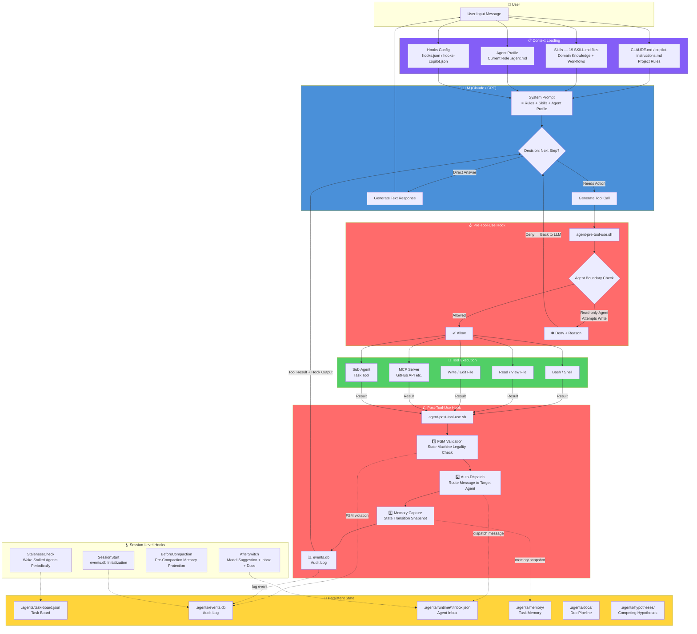
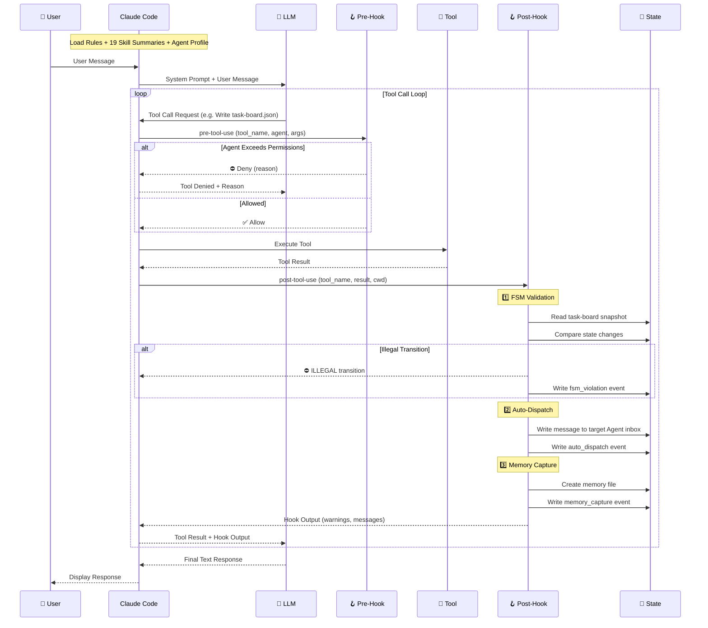
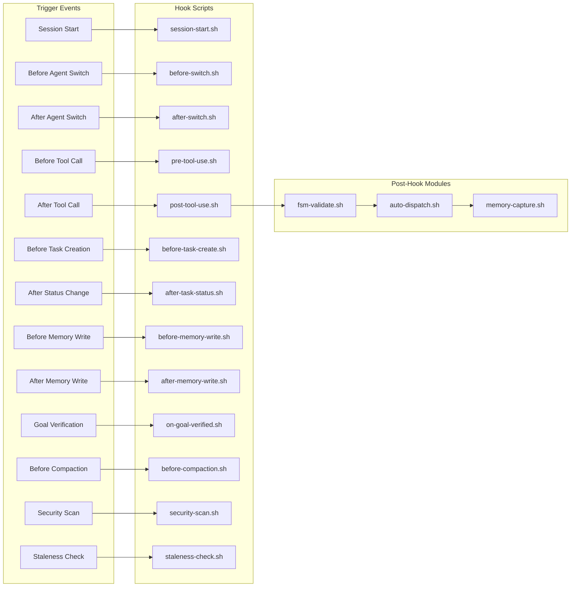
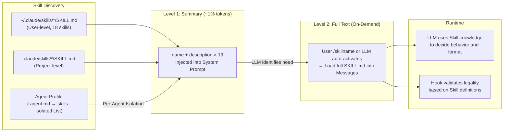

# Claude Code Execution Flow

## Main Flow — User Message → Tool Call → Response

```mermaid
flowchart TB
    subgraph User["👤 User"]
        U1[User Input Message]
    end

    subgraph Context["📋 Context Loading"]
        C1[CLAUDE.md / copilot-instructions.md<br/>Project Rules]
        C2[Skills — 19 SKILL.md files<br/>Domain Knowledge + Workflows]
        C3[Agent Profile<br/>Current Role .agent.md]
        C4[Hooks Config<br/>hooks.json / hooks-copilot.json]
    end

    subgraph LLM["🧠 LLM (Claude / GPT)"]
        L1[System Prompt<br/>= Rules + Skills + Agent Profile]
        L2{Decision: Next Step?}
        L3[Generate Tool Call]
        L4[Generate Text Response]
    end

    subgraph Hooks_Pre["🪝 Pre-Tool-Use Hook"]
        HP1[agent-pre-tool-use.sh]
        HP2{Agent Boundary Check}
        HP3[✅ Allow]
        HP4[⛔ Deny + Reason]
    end

    subgraph Tools["🔧 Tool Execution"]
        T1[Bash / Shell]
        T2[Read / View File]
        T3[Write / Edit File]
        T4[MCP Server<br/>GitHub API etc.]
        T5[Sub-Agent<br/>Task Tool]
    end

    subgraph Hooks_Post["🪝 Post-Tool-Use Hook"]
        HPO1[agent-post-tool-use.sh]
        HPO2[1️⃣ FSM Validation<br/>State Machine Legality Check]
        HPO3[2️⃣ Auto-Dispatch<br/>Route Message to Target Agent]
        HPO4[3️⃣ Memory Capture<br/>State Transition Snapshot]
        HPO5[📊 events.db<br/>Audit Log]
    end

    subgraph Session_Hooks["🪝 Session-Level Hooks"]
        SH1[SessionStart<br/>events.db Initialization]
        SH2[AfterSwitch<br/>Model Suggestion + Inbox + Docs]
        SH3[BeforeCompaction<br/>Pre-Compaction Memory Protection]
        SH4[StalenessCheck<br/>Wake Stalled Agents Periodically]
    end

    subgraph State["💾 Persistent State"]
        S1[.agents/task-board.json<br/>Task Board]
        S2[.agents/events.db<br/>Audit Log]
        S3[.agents/runtime/*/inbox.json<br/>Agent Inbox]
        S4[.agents/memory/<br/>Task Memory]
        S5[.agents/docs/<br/>Doc Pipeline]
        S6[.agents/hypotheses/<br/>Competing Hypotheses]
    end

    %% Main flow
    U1 --> C1 & C2 & C3 & C4
    C1 & C2 & C3 & C4 --> L1
    L1 --> L2
    L2 -->|Needs Action| L3
    L2 -->|Direct Answer| L4
    L4 --> U1

    %% Tool call flow
    L3 --> HP1
    HP1 --> HP2
    HP2 -->|Read-only Agent<br/>Attempts Write| HP4
    HP2 -->|Allowed| HP3
    HP4 -->|Deny → Back to LLM| L2
    HP3 --> T1 & T2 & T3 & T4 & T5

    %% Tool results
    T1 & T2 & T3 & T4 & T5 -->|Result| HPO1
    HPO1 --> HPO2
    HPO2 --> HPO3
    HPO3 --> HPO4
    HPO4 --> HPO5

    %% Post-hook writes state
    HPO2 -.->|FSM violation| S2
    HPO3 -.->|dispatch message| S3
    HPO4 -.->|memory snapshot| S4
    HPO5 -.->|log event| S2

    %% Result back to LLM
    HPO5 -->|Tool Result + Hook Output| L2

    %% Session-level hooks
    SH1 -.-> S2
    SH2 -.-> S3
    SH4 -.-> S1

    style LLM fill:#4a90d9,color:#fff
    style Hooks_Pre fill:#ff6b6b,color:#fff
    style Hooks_Post fill:#ff6b6b,color:#fff
    style Tools fill:#51cf66,color:#fff
    style State fill:#ffd43b,color:#333
    style Context fill:#845ef7,color:#fff
```

## Detailed Interaction Sequence Diagram

```mermaid
sequenceDiagram
    participant U as 👤 User
    participant CC as Claude Code
    participant LLM as 🧠 LLM
    participant PRE as 🪝 Pre-Hook
    participant TOOL as 🔧 Tool
    participant POST as 🪝 Post-Hook
    participant DB as 💾 State

    Note over CC: Load Rules + 19 Skill Summaries + Agent Profile

    U->>CC: User Message
    CC->>LLM: System Prompt + User Message

    loop Tool Call Loop
        LLM->>CC: Tool Call Request (e.g. Write task-board.json)

        CC->>PRE: pre-tool-use (tool_name, agent, args)
        alt Agent Exceeds Permissions
            PRE-->>CC: ⛔ Deny (reason)
            CC-->>LLM: Tool Denied + Reason
        else Allowed
            PRE-->>CC: ✅ Allow
        end

        CC->>TOOL: Execute Tool
        TOOL-->>CC: Tool Result

        CC->>POST: post-tool-use (tool_name, result, cwd)

        Note over POST: 1️⃣ FSM Validation
        POST->>DB: Read task-board snapshot
        POST->>DB: Compare state changes
        alt Illegal Transition
            POST-->>CC: ⛔ ILLEGAL transition
            POST->>DB: Write fsm_violation event
        end

        Note over POST: 2️⃣ Auto-Dispatch
        POST->>DB: Write message to target Agent inbox
        POST->>DB: Write auto_dispatch event

        Note over POST: 3️⃣ Memory Capture
        POST->>DB: Create memory file
        POST->>DB: Write memory_capture event

        POST-->>CC: Hook Output (warnings, messages)
        CC-->>LLM: Tool Result + Hook Output
    end

    LLM-->>CC: Final Text Response
    CC-->>U: Display Response
```

## Hook Trigger Matrix

```mermaid
graph LR
    subgraph Events["Trigger Events"]
        E1[Session Start]
        E2[Before Agent Switch]
        E3[After Agent Switch]
        E4[Before Tool Call]
        E5[After Tool Call]
        E6[Before Task Creation]
        E7[After Status Change]
        E8[Before Memory Write]
        E9[After Memory Write]
        E10[Goal Verification]
        E11[Before Compaction]
        E12[Security Scan]
        E13[Staleness Check]
    end

    subgraph Hooks["Hook Scripts"]
        H1[session-start.sh]
        H2[before-switch.sh]
        H3[after-switch.sh]
        H4[pre-tool-use.sh]
        H5[post-tool-use.sh]
        H6[before-task-create.sh]
        H7[after-task-status.sh]
        H8[before-memory-write.sh]
        H9[after-memory-write.sh]
        H10[on-goal-verified.sh]
        H11[before-compaction.sh]
        H12[security-scan.sh]
        H13[staleness-check.sh]
    end

    subgraph Modules["Post-Hook Modules"]
        M1[fsm-validate.sh]
        M2[auto-dispatch.sh]
        M3[memory-capture.sh]
    end

    E1 --> H1
    E2 --> H2
    E3 --> H3
    E4 --> H4
    E5 --> H5
    E6 --> H6
    E7 --> H7
    E8 --> H8
    E9 --> H9
    E10 --> H10
    E11 --> H11
    E12 --> H12
    E13 --> H13

    H5 --> M1 --> M2 --> M3
```

## Skill Loading Mechanism

```mermaid
flowchart LR
    subgraph Load["Skill Discovery"]
        direction TB
        L1["~/.claude/skills/*/SKILL.md<br/>(User-level, 18 skills)"]
        L2[".claude/skills/*/SKILL.md<br/>(Project-level)"]
        L3["Agent Profile<br/>(.agent.md → skills: Isolated List)"]
    end

    subgraph Level1["Level 1: Summary (~1% tokens)"]
        I1["name + description × 19<br/>Injected into System Prompt"]
    end

    subgraph Level2["Level 2: Full Text (On-Demand)"]
        I4["User /skillname or LLM auto-activates<br/>→ Load full SKILL.md into Messages"]
    end

    subgraph Runtime["Runtime"]
        R1["LLM uses Skill knowledge<br/>to decide behavior and format"]
        R2["Hook validates legality<br/>based on Skill definitions"]
    end

    L1 & L2 --> I1
    L3 -->|"Per-Agent Isolation"| I1
    I1 -->|"LLM identifies need"| I4
    I4 --> R1 & R2
```
