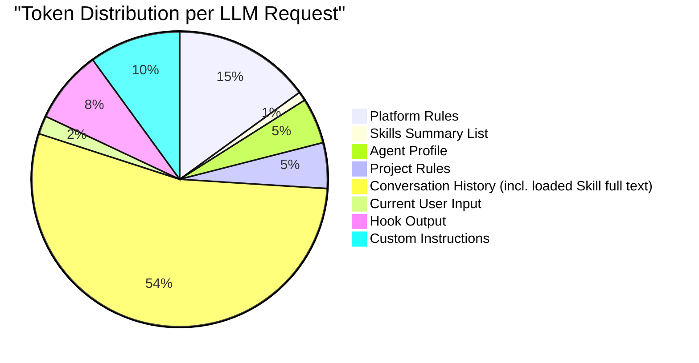
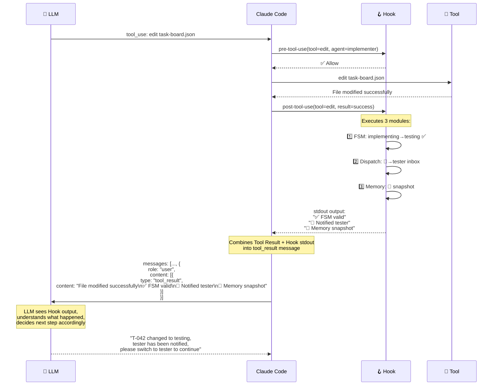

# LLM Request Message Structure

## Message Structure Sent to LLM

After each user input, Claude Code / Copilot CLI assembles a complete request to the LLM. Here is the structure of that request:

```mermaid
block-beta
    columns 1

    block:header["📡 API Request to LLM"]
        columns 1
        A["model: 'claude-sonnet-4-20250514'"]
        B["max_tokens: 16384"]
        C["temperature: 0"]
    end

    block:system["📋 System Prompt"]
        columns 1

        block:rules["🔧 Layer 1: Platform Rules"]
            columns 1
            R1["Tool usage rules (edit/bash/view/grep...)"]
            R2["Security constraints (no secret leaks, no dangerous ops)"]
            R3["Output format rules (concise replies, code style)"]
        end

        block:skills["📚 Layer 2: Skills Summary (Discovery List)"]
            columns 1
            SK1["agent-fsm — State machine rules (name+desc, ≤250 chars)"]
            SK2["agent-messaging — Message format"]
            SK3["agent-task-board — Task management"]
            SK4["... 18 skill summaries total"]
            SK5["💡 Full SKILL.md loaded only on invocation"]
        end

        block:agent["👤 Layer 3: Agent Profile"]
            columns 1
            AP1["Current role: implementer"]
            AP2["Allowed tools: [edit, bash, git]"]
            AP3["Constraints: TDD discipline, pre-commit verify"]
            AP4["Model hint: model_hint: claude-sonnet"]
        end

        block:project["📋 Layer 4: Project Rules"]
            columns 1
            PR1["CLAUDE.md / copilot-instructions.md"]
            PR2["Custom rules: commit format, branch strategy, etc."]
        end
    end

    block:messages["💬 Messages Array (Conversation History)"]
        columns 1

        block:msg1["Message 1: user"]
            columns 1
            M1["'Change T-042 status to testing'"]
        end

        block:msg2["Message 2: assistant (previous reply)"]
            columns 1
            M2["'OK, I will modify task-board.json...'"]
        end

        block:msg3["Message 3: tool_use (tool invocation)"]
            columns 1
            M3["tool: edit<br/>file: .agents/task-board.json<br/>old_str: status: implementing<br/>new_str: status: testing"]
        end

        block:msg4["Message 4: tool_result (tool + hook results)"]
            columns 1
            M4["Tool result: File modified<br/>+ Hook output: '✅ FSM: implementing→testing valid'<br/>+ Hook output: '📨 Message sent to tester'<br/>+ Hook output: '🧠 Memory snapshot created'"]
        end

        block:msg5["Message 5: user (current input)"]
            columns 1
            M5["'Continue to next step'"]
        end
    end

    style header fill:#333,color:#fff
    style system fill:#4a90d9,color:#fff
    style rules fill:#845ef7,color:#fff
    style skills fill:#ffd43b,color:#333
    style agent fill:#ff6b6b,color:#fff
    style project fill:#51cf66,color:#fff
    style messages fill:#ff922b,color:#fff
```



## Simplified View — Message Hierarchy

```
┌─────────────────────────────────────────────────────────────┐
│  API Request                                                 │
│  model: claude-sonnet-4     max_tokens: 16384               │
├─────────────────────────────────────────────────────────────┤
│                                                              │
│  ┌─── System Prompt ──────────────────────────────────────┐ │
│  │                                                         │ │
│  │  ┌── 🔧 Platform Rules ─────────────────────────────┐  │ │
│  │  │  • Tool definitions (edit, bash, view, grep...)   │  │ │
│  │  │  • Security constraints                           │  │ │
│  │  │  • Output format rules                            │  │ │
│  │  └──────────────────────────────────────────────────┘  │ │
│  │                                                         │ │
│  │  ┌── 📚 Skills Summary List (~1% token) ──────────────┐  │ │
│  │  │  agent-fsm:        "FSM — Manage task states..."  │  │ │
│  │  │  agent-messaging:  "Messaging — Inter-agent..."   │  │ │
│  │  │  agent-task-board: "Task board — CRUD + lock..."  │  │ │
│  │  │  ... 18 total, each ≤250 char description          │  │ │
│  │  │  💡 Full text loaded on-demand into Messages[]     │  │ │
│  │  └──────────────────────────────────────────────────┘  │ │
│  │                                                         │ │
│  │  ┌── 👤 Agent Profile (.agent.md) ─────────────────┐  │ │
│  │  │  role: implementer                               │  │ │
│  │  │  tools: [edit, bash, git, npm]                   │  │ │
│  │  │  constraints: TDD discipline, pre-commit verify  │  │ │
│  │  └──────────────────────────────────────────────────┘  │ │
│  │                                                         │ │
│  │  ┌── 📋 Project Rules (CLAUDE.md) ─────────────────┐  │ │
│  │  │  commit format, branch strategy, custom rules    │  │ │
│  │  └──────────────────────────────────────────────────┘  │ │
│  │                                                         │ │
│  └─────────────────────────────────────────────────────────┘ │
│                                                              │
│  ┌─── Messages[] ─────────────────────────────────────────┐ │
│  │                                                         │ │
│  │  [0] role: user                                        │ │
│  │      content: "Change T-042 to testing"                 │ │
│  │                                                         │ │
│  │  [1] role: assistant                                    │ │
│  │      content: "OK, modifying..."                        │ │
│  │      tool_use: { name: "edit", input: {...} }           │ │
│  │                                                         │ │
│  │  [2] role: user (tool_result)                           │ │
│  │      content: "File modified"                           │ │
│  │      + hook_output: "✅ FSM valid"                      │ │
│  │      + hook_output: "📨 Notified tester"                │ │
│  │      + hook_output: "🧠 Memory created"                 │ │
│  │                                                         │ │
│  │  [3] role: user                                         │ │
│  │      content: "Continue to next step"                   │ │
│  │                                                         │ │
│  └─────────────────────────────────────────────────────────┘ │
│                                                              │
└─────────────────────────────────────────────────────────────┘
```

## Token Distribution Estimate



> **Two-Level Loading Explanation**:
> - **Skills Summary List (~1%)**: Each turn injects only skill name + description truncated to 250 chars (not full text) into System Prompt
> - **Skill Full Text (on-demand)**: Complete `SKILL.md` is loaded into conversation history only when LLM determines a skill is needed or user invokes `/skillname`
> - **Custom Instructions**: `copilot-instructions.md` / `CLAUDE.md` are **injected in full every turn**, unlike Skills
> - Both Claude Code and Copilot CLI use this mechanism, following the [Agent Skills open standard](https://agentskills.io)

## How Hook Output Flows Back to LLM



## Key Insights

1. **Skills are "knowledge" not "code"** — LLM **understands** rules after reading SKILL.md; it doesn't execute them
2. **Hooks are the real "execution"** — Shell scripts run outside LLM, enforcing rules
3. **Hook output flows back** — Hook stdout is appended to tool_result, visible to LLM
4. **Two-level loading** — System Prompt only contains skill summary list (~1% tokens); full text is loaded on-demand into Messages
5. **Agent switch = Profile swap** — Skills summary list stays the same; only the Agent Profile section is replaced; skill permissions are enforced via prompt constraints
