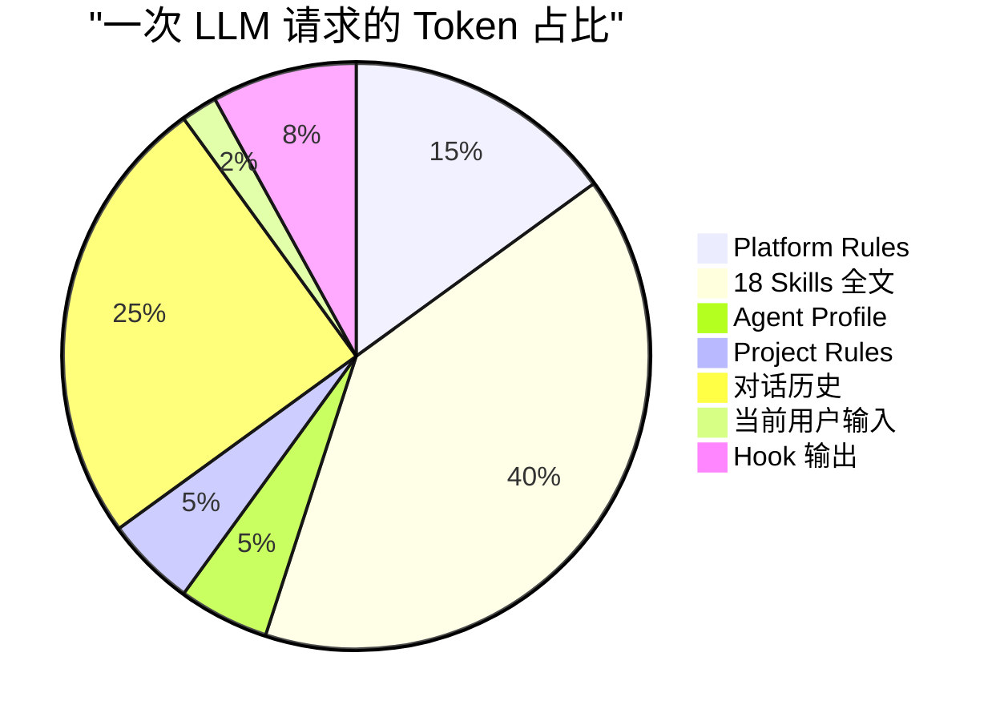
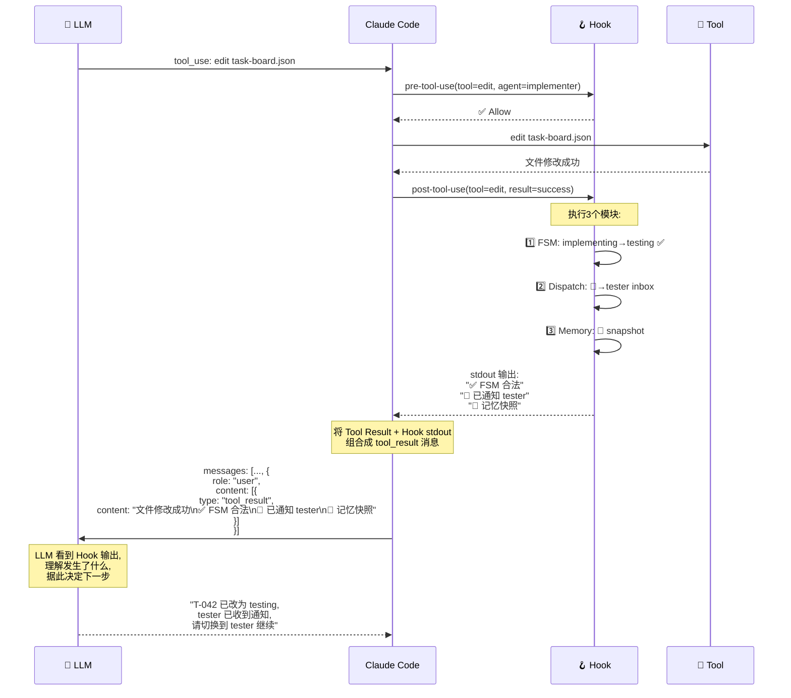

# LLM 请求报文结构

## 发送给大模型的消息结构

每次用户输入后，Claude Code / Copilot CLI 会组装一个完整的请求发送给 LLM。以下是这个"报文"的结构：

```mermaid
block-beta
    columns 1

    block:header["📡 API Request to LLM"]
        columns 1
        A["model: 'claude-sonnet-4-20250514'"]
        B["max_tokens: 16384"]
        C["temperature: 0"]
    end

    block:system["📋 System Prompt (系统提示词)"]
        columns 1

        block:rules["🔧 第1层: 平台规则"]
            columns 1
            R1["工具使用规则 (edit/bash/view/grep...)"]
            R2["安全限制 (不能泄露密钥、不能执行危险操作)"]
            R3["输出格式规则 (简洁回复、代码风格)"]
        end

        block:skills["📚 第2层: Skills 知识库 (全部注入)"]
            columns 1
            SK1["agent-fsm/SKILL.md — 状态机规则"]
            SK2["agent-messaging/SKILL.md — 消息格式"]
            SK3["agent-task-board/SKILL.md — 任务管理"]
            SK4["agent-hypothesis/SKILL.md — 竞争假设"]
            SK5["... 共 18 个 Skills 全文"]
        end

        block:agent["👤 第3层: Agent Profile"]
            columns 1
            AP1["当前角色: implementer"]
            AP2["允许工具: [edit, bash, git]"]
            AP3["行为约束: TDD 纪律、提交前验证"]
            AP4["模型建议: model_hint: claude-sonnet"]
        end

        block:project["📋 第4层: 项目规则"]
            columns 1
            PR1["CLAUDE.md / copilot-instructions.md"]
            PR2["自定义规则: commit 格式、分支策略等"]
        end
    end

    block:messages["💬 Messages 数组 (对话历史)"]
        columns 1

        block:msg1["消息 1: user"]
            columns 1
            M1["'请把 T-042 状态改为 testing'"]
        end

        block:msg2["消息 2: assistant (上一轮回复)"]
            columns 1
            M2["'好的，我来修改 task-board.json...'"]
        end

        block:msg3["消息 3: tool_use (工具调用)"]
            columns 1
            M3["tool: 'edit'<br/>file: '.agents/task-board.json'<br/>old_str: '\"status\": \"implementing\"'<br/>new_str: '\"status\": \"testing\"'"]
        end

        block:msg4["消息 4: tool_result (工具+Hook结果)"]
            columns 1
            M4["工具结果: 文件已修改<br/>+ Hook输出: '✅ FSM: implementing→testing 合法'<br/>+ Hook输出: '📨 消息已发送给 tester'<br/>+ Hook输出: '🧠 记忆快照已创建'"]
        end

        block:msg5["消息 5: user (当前输入)"]
            columns 1
            M5["'继续下一步'"]
        end
    end

    style header fill:#333,color:#fff
    style system fill:#4a90d9,color:#fff
    style rules fill:#845ef7,color:#fff
    style skills fill:#ffd43b,color:#333
    style agent fill:#ff6b6b,color:#fff
    style project fill:#51cf66,color:#fff
    style messages fill:#ff922b,color:#fff
```

## 简化视图 — 报文层次结构

```
┌─────────────────────────────────────────────────────────────┐
│  API Request                                                 │
│  model: claude-sonnet-4     max_tokens: 16384               │
├─────────────────────────────────────────────────────────────┤
│                                                              │
│  ┌─── System Prompt ──────────────────────────────────────┐ │
│  │                                                         │ │
│  │  ┌── 🔧 Platform Rules ─────────────────────────────┐  │ │
│  │  │  • Tool definitions (edit, bash, view, grep...)   │  │ │
│  │  │  • Security constraints                           │  │ │
│  │  │  • Output format rules                            │  │ │
│  │  └──────────────────────────────────────────────────┘  │ │
│  │                                                         │ │
│  │  ┌── 📚 Skills (全部18个 SKILL.md 原文) ──────────────┐  │ │
│  │  │  agent-fsm:        ~200 lines (FSM rules)         │  │ │
│  │  │  agent-messaging:  ~290 lines (message schema)    │  │ │
│  │  │  agent-task-board: ~180 lines (task CRUD)         │  │ │
│  │  │  agent-memory:     ~250 lines (3-layer memory)    │  │ │
│  │  │  agent-hypothesis: ~185 lines (competitive)       │  │ │
│  │  │  ... 共 18 个, ~3000+ lines total                  │  │ │
│  │  └──────────────────────────────────────────────────┘  │ │
│  │                                                         │ │
│  │  ┌── 👤 Agent Profile (.agent.md) ─────────────────┐  │ │
│  │  │  role: implementer                               │  │ │
│  │  │  tools: [edit, bash, git, npm]                   │  │ │
│  │  │  constraints: TDD discipline, pre-commit verify  │  │ │
│  │  └──────────────────────────────────────────────────┘  │ │
│  │                                                         │ │
│  │  ┌── 📋 Project Rules (CLAUDE.md) ─────────────────┐  │ │
│  │  │  commit format, branch strategy, custom rules    │  │ │
│  │  └──────────────────────────────────────────────────┘  │ │
│  │                                                         │ │
│  └─────────────────────────────────────────────────────────┘ │
│                                                              │
│  ┌─── Messages[] ─────────────────────────────────────────┐ │
│  │                                                         │ │
│  │  [0] role: user                                        │ │
│  │      content: "请把 T-042 改为 testing"                  │ │
│  │                                                         │ │
│  │  [1] role: assistant                                    │ │
│  │      content: "好的，我来修改..."                         │ │
│  │      tool_use: { name: "edit", input: {...} }           │ │
│  │                                                         │ │
│  │  [2] role: user (tool_result)                           │ │
│  │      content: "文件已修改"                                │ │
│  │      + hook_output: "✅ FSM 合法"                        │ │
│  │      + hook_output: "📨 已通知 tester"                   │ │
│  │      + hook_output: "🧠 记忆已创建"                      │ │
│  │                                                         │ │
│  │  [3] role: user                                         │ │
│  │      content: "继续下一步"                                │ │
│  │                                                         │ │
│  └─────────────────────────────────────────────────────────┘ │
│                                                              │
└─────────────────────────────────────────────────────────────┘
```

## Token 占比估算



## Hook 输出如何回流到 LLM



## 关键洞察

1. **Skills 是"知识"不是"代码"** — LLM 读了 SKILL.md 后**理解**了规则，不是在执行它
2. **Hook 是真正的"执行"** — Shell 脚本在 LLM 之外运行，强制执行规则
3. **Hook 输出回流** — Hook 的 stdout 被拼接进 tool_result，LLM 能看到这些信息
4. **每次请求都带全量 Skills** — 不是按需加载，是全部注入（所以 token 占比很高）
5. **Agent 切换 = 更换 Profile** — Skills 不变，只是 Agent Profile 部分被替换
