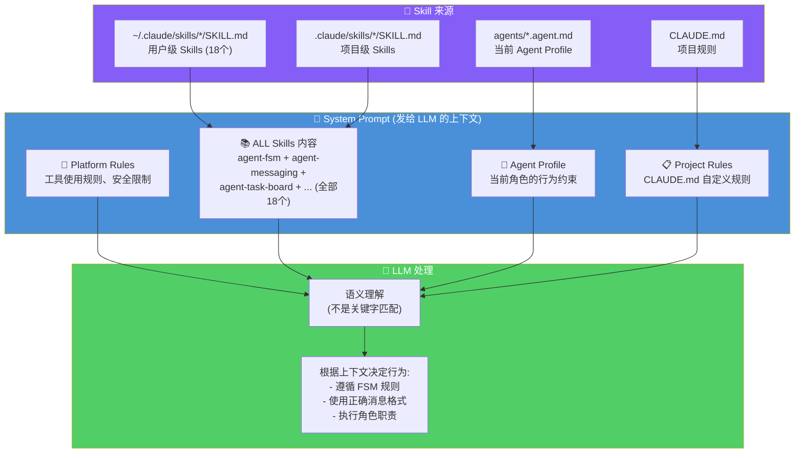
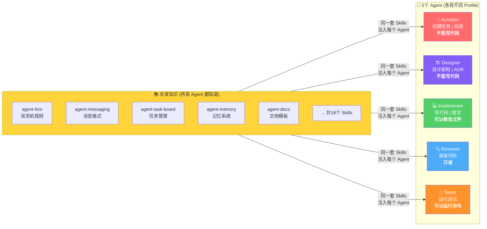
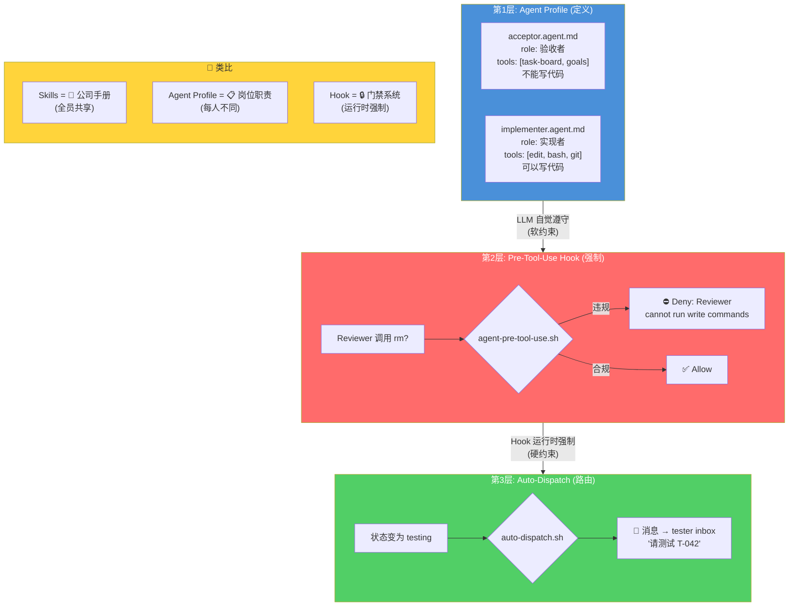
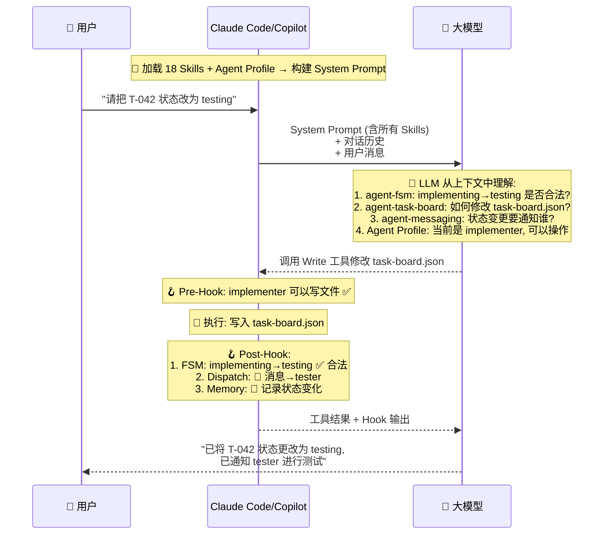

# Skills 工作机制 — 加载、注入与 Agent 行为

## 1. Skill 加载 → System Prompt 构建

```mermaid
flowchart TB
    subgraph Sources["📂 Skill 来源"]
        S1["~/.claude/skills/*/SKILL.md<br/>用户级 Skills (18个)"]
        S2[".claude/skills/*/SKILL.md<br/>项目级 Skills"]
        S3["CLAUDE.md<br/>项目规则"]
        S4["agents/*.agent.md<br/>当前 Agent Profile"]
    end

    subgraph SystemPrompt["📝 System Prompt (发给 LLM 的上下文)"]
        direction TB
        SP1["🔧 Platform Rules<br/>工具使用规则、安全限制"]
        SP2["📚 ALL Skills 内容<br/>agent-fsm + agent-messaging +<br/>agent-task-board + ... (全部18个)"]
        SP3["👤 Agent Profile<br/>当前角色的行为约束"]
        SP4["📋 Project Rules<br/>CLAUDE.md 自定义规则"]
    end

    subgraph LLM["🧠 LLM 处理"]
        L1["语义理解<br/>(不是关键字匹配)"]
        L2["根据上下文决定行为:<br/>- 遵循 FSM 规则<br/>- 使用正确消息格式<br/>- 执行角色职责"]
    end

    S1 --> SP2
    S2 --> SP2
    S3 --> SP4
    S4 --> SP3

    SP1 & SP2 & SP3 & SP4 --> L1 --> L2

    style Sources fill:#845ef7,color:#fff
    style SystemPrompt fill:#4a90d9,color:#fff
    style LLM fill:#51cf66,color:#fff
```

## 2. 多 Agent ≠ 不同 Skills

```mermaid
flowchart LR
    subgraph SharedKnowledge["📚 共享知识 (所有 Agent 都知道)"]
        SK1["agent-fsm<br/>状态机规则"]
        SK2["agent-messaging<br/>消息格式"]
        SK3["agent-task-board<br/>任务管理"]
        SK4["agent-memory<br/>记忆系统"]
        SK5["agent-docs<br/>文档模板"]
        SK6["... 共18个 Skills"]
    end

    subgraph Agents["👥 5个 Agent (各有不同 Profile)"]
        direction TB
        A1["🎯 Acceptor<br/>创建任务 | 验收<br/><b>不能写代码</b>"]
        A2["🏗️ Designer<br/>设计架构 | ADR<br/><b>不能写代码</b>"]
        A3["💻 Implementer<br/>写代码 | 提交<br/><b>可以修改文件</b>"]
        A4["🔍 Reviewer<br/>审查代码<br/><b>只读</b>"]
        A5["🧪 Tester<br/>运行测试<br/><b>可以运行命令</b>"]
    end

    SharedKnowledge -->|"同一套 Skills<br/>注入每个 Agent"| A1 & A2 & A3 & A4 & A5

    style SharedKnowledge fill:#ffd43b,color:#333
    style A1 fill:#ff6b6b,color:#fff
    style A2 fill:#845ef7,color:#fff
    style A3 fill:#51cf66,color:#fff
    style A4 fill:#4dabf7,color:#fff
    style A5 fill:#ff922b,color:#fff
```

## 3. 三层行为控制体系

```mermaid
flowchart TB
    subgraph Layer1["第1层: Agent Profile (定义)"]
        direction LR
        P1["acceptor.agent.md<br/>role: 验收者<br/>tools: [task-board, goals]<br/>不能写代码"]
        P2["implementer.agent.md<br/>role: 实现者<br/>tools: [edit, bash, git]<br/>可以写代码"]
    end

    subgraph Layer2["第2层: Pre-Tool-Use Hook (强制)"]
        direction LR
        H1["Reviewer 调用 rm?"]
        H2{agent-pre-tool-use.sh}
        H3["⛔ Deny: Reviewer<br/>cannot run write commands"]
        H4["✅ Allow"]
    end

    subgraph Layer3["第3层: Auto-Dispatch (路由)"]
        direction LR
        D1["状态变为 testing"]
        D2{auto-dispatch.sh}
        D3["📨 消息 → tester inbox<br/>'请测试 T-042'"]
    end

    subgraph Analogy["🏢 类比"]
        direction TB
        AN1["Skills = 📖 公司手册<br/>(全员共享)"]
        AN2["Agent Profile = 📋 岗位职责<br/>(每人不同)"]
        AN3["Hook = 🔒 门禁系统<br/>(运行时强制)"]
    end

    Layer1 -->|"LLM 自觉遵守<br/>(软约束)"| Layer2
    Layer2 -->|"Hook 运行时强制<br/>(硬约束)"| Layer3

    H1 --> H2
    H2 -->|"违规"| H3
    H2 -->|"合规"| H4
    D1 --> D2 --> D3

    style Layer1 fill:#4a90d9,color:#fff
    style Layer2 fill:#ff6b6b,color:#fff
    style Layer3 fill:#51cf66,color:#fff
    style Analogy fill:#ffd43b,color:#333
```

## 4. 完整请求生命周期

```mermaid
sequenceDiagram
    participant U as 👤 用户
    participant CC as Claude Code/Copilot
    participant LLM as 🧠 大模型

    Note over CC: 📂 加载 18 Skills + Agent Profile → 构建 System Prompt

    U->>CC: "请把 T-042 状态改为 testing"

    CC->>LLM: System Prompt (含所有 Skills)<br/>+ 对话历史<br/>+ 用户消息

    Note over LLM: 🧠 LLM 从上下文中理解:<br/>1. agent-fsm: implementing→testing 是否合法?<br/>2. agent-task-board: 如何修改 task-board.json?<br/>3. agent-messaging: 状态变更要通知谁?<br/>4. Agent Profile: 当前是 implementer, 可以操作

    LLM-->>CC: 调用 Write 工具修改 task-board.json

    Note over CC: 🪝 Pre-Hook: implementer 可以写文件 ✅
    Note over CC: 🔧 执行: 写入 task-board.json
    Note over CC: 🪝 Post-Hook:<br/>1. FSM: implementing→testing ✅ 合法<br/>2. Dispatch: 📨 消息→tester<br/>3. Memory: 🧠 记录状态变化

    CC-->>LLM: 工具结果 + Hook 输出

    LLM-->>U: "已将 T-042 状态更改为 testing,<br/>已通知 tester 进行测试"
```
